# How to add your own system call to linux kernel

## Installation

- install ubuntu <b>16.04</b> on virtual box with alteast <b>50gb</b> of space allocated. (download the iso from [here](https://releases.ubuntu.com/) )

## My system specifications for virtual box

- allocated <b>4gb</b> ram, <b>4</b> cores, <b>60gb</b> of space, <b>64</b> bit

## Steps I followed

- After installing the Ubuntu <b>16.04</b> run

```bash
sudo apt-get update
```

```bash
sudo apt-get upgrade
```

```bash
sudo apt-get install build-essential
```

- check your kernel release using this command. In my case it was `4.15.0 - generic release`

```bash
uname -r
```

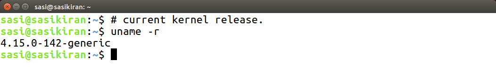

- so i downloaded kernel release of higher version `4.17.4` using this command. so that kernel will update automatically when we reboot.

```bash
wget https://www.kernel.org/pub/linux/kernel/v4.x/linux-4.17.4.tar.xz
```

- extract the kernel source code.

```bash
sudo tar -xvf linux-4.17.4.tar.xz -C/usr/src/
```

- become superuser using

```bash
sudo -s
```

- navigate to the directory where kernel files were extracted.

```bash
cd /usr/src/linux-4.17.4/
```

## Adding the sys_hello() system call.

- make directory hello/ and create a file hello.c in hello/ directory

```bash
mkdir hello/ && cd hello/ && touch hello.c
```

- add the following code to hello.c and save.

```c
#include <linux/kernel.h>

asmlinkage long sys_hello(void) {
	printk("Hello world from my sys call\n");
	return 0;
}
```

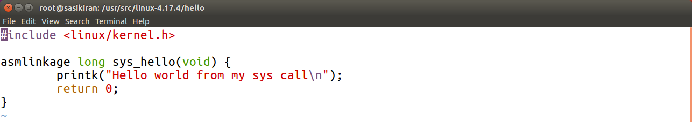

- create Makefile in the hello/ directory.

```bash
touch Makefile
```

- add the following line to Makefile and save.

```Makefile
obj-y := hello.o
```

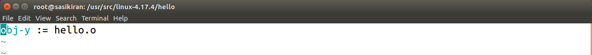

- go back to kernels directory.

```bash
cd /usr/src/linux-4.17.4/
```

- open the Makefile

```bash
 gedit Makefile
```

- search for the word `core-y` and you'll find this line as the second instance of ur search.
  `core-y += kernel/ mm/ fs/ ipc/ security/ crypto/ block/`

- add `hello/` at the end of this line.
  `core-y += kernel/ mm/ fs/ ipc/ security/ crypto/ block/ hello/`

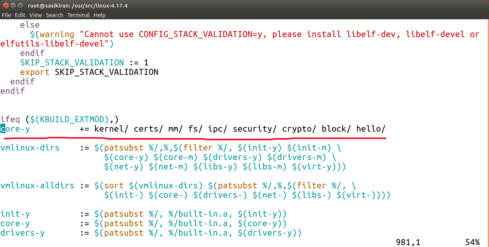

## Adding our system call to systemcall table.

```bash
cd arch/x86/entry/syscalls/
```

- incase if ur using 32 bit system u have to modify `syscall_32.tbl`
- i am using 64 bit system so modify `systemcall_64.tbl`

```bash
gedit syscall_64.tbl
```

- add this line at the end of the file and save.

```
548       64        hello          sys_hello
```

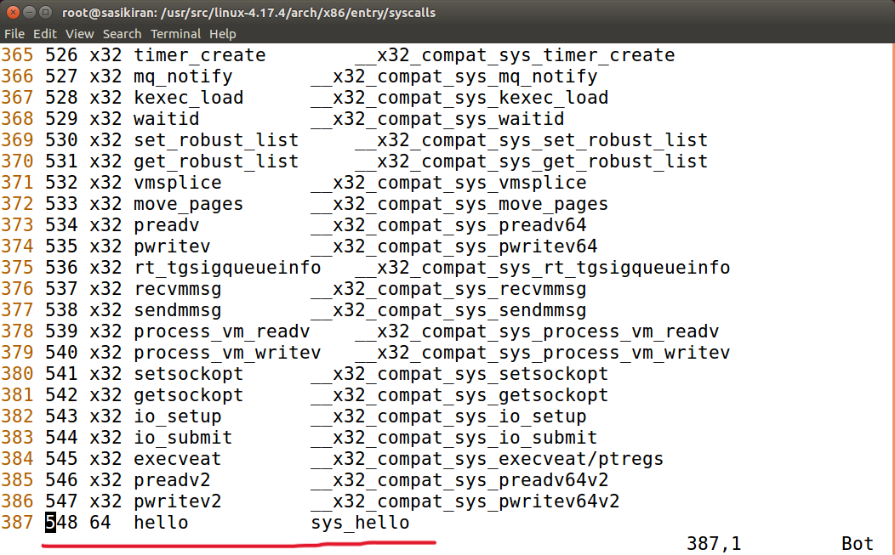

- <b> NOTE :</b>
- The last entry was 547 so I added the next number 548.
- Also, note that I’ve written 64 in my system because it is 64 bit.

## Adding our system call prototype to syscalls.h headerfile.

```bash
cd /usr/src/linux-4.17.4/include/linux/
```

- open the syscalls.h header file.

```bash
gedit syscalls.h
```

- add the following line at the end of the file before the `#endif` statement. save and exit.

```
asmlinkage long sys_hello(void);
```

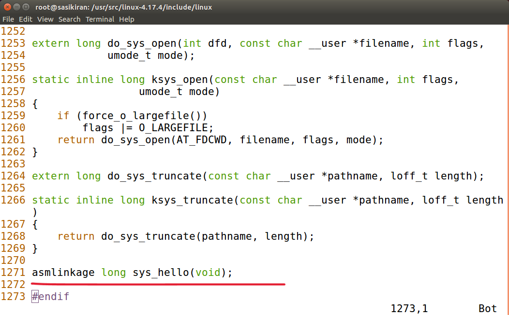

## Before compiling the kernel. run the following commands.

```bash
sudo apt-get install gcc
sudo apt-get install libncurses5-dev
sudo apt-get install libncurses-dev
sudo apt-get install bison
sudo apt-get install flex
sudo apt-get install libssl-dev
sudo apt-get install libelf-dev
sudo apt-get update
sudo apt-get upgrade
```

- go back to kernels directory.

```bash
cd /usr/src/linux-4.17.4/
```

- run

```bash
sudo make menuconfig
```

- <b>NOTE</b>:
- Once the above command is used to configure the Linux kernel, you will get a pop up window with the list of menus and you can select the items for the new configuration. If your unfamiliar with the configuration just check for the file systems menu and check whether “ext4” is chosen or not, if not select it and save the configuration.

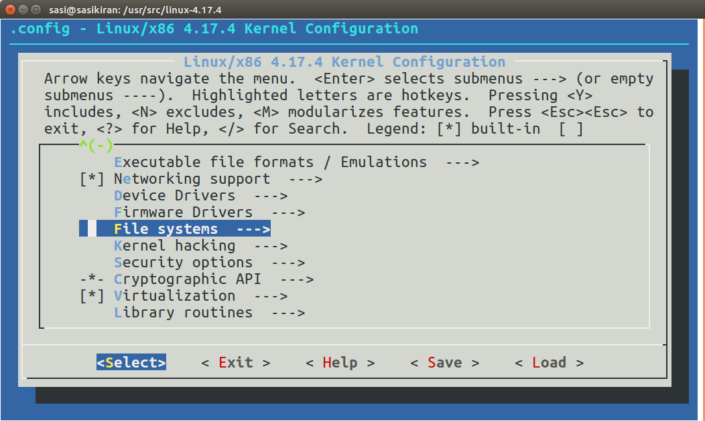

## compile the kernel using this command `sudo make -jn`

- `n` is no of cores.
- in my case since i allocated 4 cores to virtual box i did like this.

```bash
sudo make -j4
```

`It might take long time based on your system specifications. It took me around 50min. Be patient.`

## Install the kernel.

```bash
sudo make modules_install install
```

- to update your kernel u have to restart ur system.

```bash
shutdown -r now
```

- after rebooting u can check ur kernel release version.
  `U can see 4.17.4`

```bash
uname -r
```

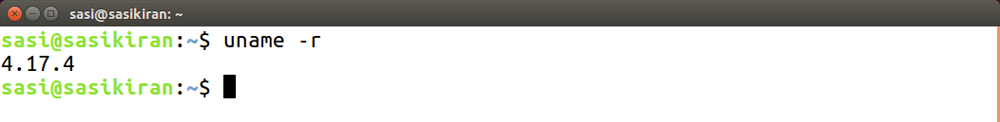

## Testing our system call.

- create a .c file on your desktop.

```bash
touch ~/Desktop/test.c
```

- add the following code to test.c `remember our hello sys_call() entry was 548`

```c
#include <stdio.h>
#include <linux/kernel.h>
#include <sys/syscall.h>
#include <unistd.h>

int main() {
	long int returnValue = syscall(548);
	printf("System call sys_hello returned %ld\n", returnValue);
	return 0;
}
```

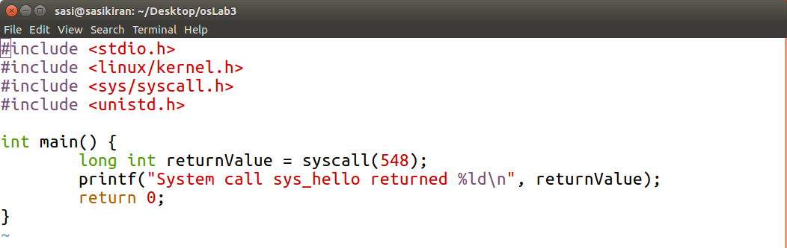

- Compile and run the code.

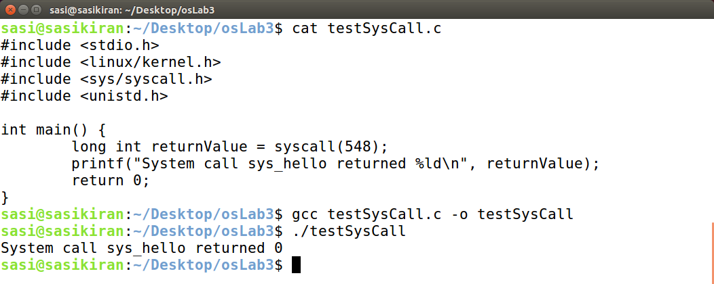

- To see the kernel message buffer run `dmesg` in the terminal. U will see `Hello world from my sys call` at the end

```bash
dmesg
```

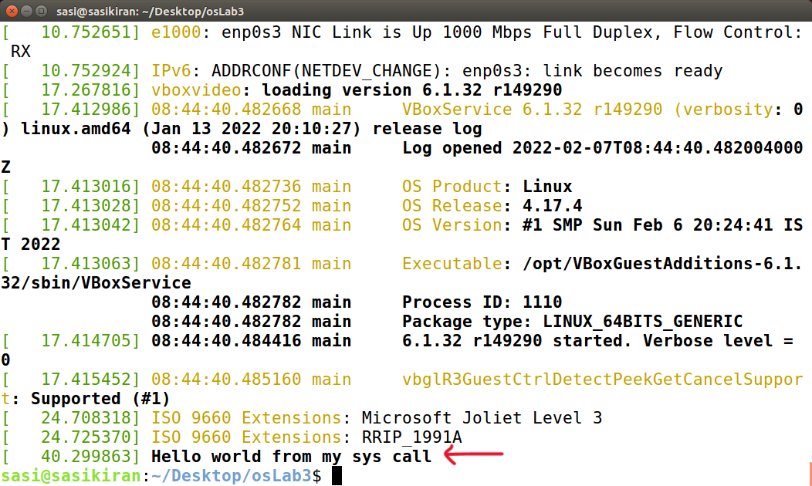

> Great Success!
